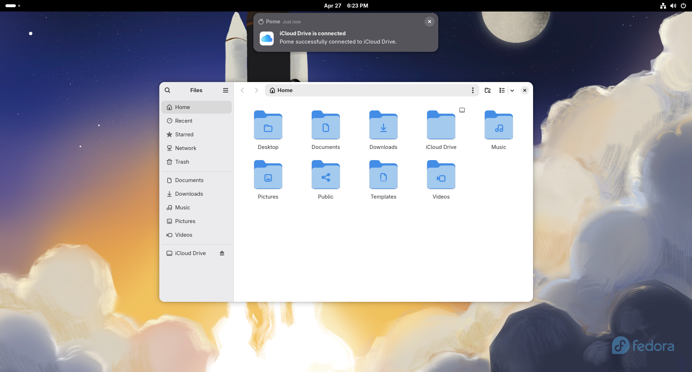

# 🍎 Pome

Pome gives Linux desktops a quiet iCloud Drive folder.

> ⚠️ Pome is currently beta software. It is ready for testing, but you may still run into rough edges, missing features, or changes between releases.



It runs in the background, mounts iCloud Drive through `rclone`, and keeps it available at `~/iCloud Drive`. When the connection needs attention, Pome lets you respond from desktop notifications: retry the mount, sign in again, or leave it waiting in the background.

## Running Pome

Install `rclone` before running Pome. Pome requires `rclone` 1.69.0 or newer (the first release with iCloud Drive support), check your installed version with:

```sh
rclone version
```

The safest way to get a recent version is the official `rclone` installer:

```sh
sudo -v
curl https://rclone.org/install.sh | sudo bash
```

If your distribution already ships `rclone` 1.69.0 or newer, you can install it from your package manager instead:

```sh
# Fedora
sudo dnf install rclone

# Ubuntu/Debian
sudo apt install rclone

# Arch Linux
sudo pacman -S rclone
```

Then run Pome from your app launcher, or start it manually:

```sh
flatpak run io.github.gabrielpalassi.pome
```

On first launch, Pome prepares an iCloud Drive remote for `rclone` and asks you to sign in. Click `Sign In` in the notification, complete the browser sign-in, and Pome will connect your iCloud Drive folder.

After the first launch, Pome adds itself to your desktop autostart entries so it can reconnect iCloud Drive when you log in.

If iCloud needs attention later, Pome will show a notification with actions:

- `Try Again` retries the mount.
- `Sign In` refreshes your iCloud session.

## Building Locally

Local builds use Flatpak Builder. You will need:

- `flatpak`
- `flatpak-builder`
- `flatpak-node-generator`
- `rclone`
- a working desktop notification portal
- the Freedesktop runtime and SDK used by the manifest

Add Flathub if you do not already have it:

```sh
flatpak remote-add --if-not-exists flathub https://flathub.org/repo/flathub.flatpakrepo
```

Install the runtime and SDK:

```sh
flatpak install flathub org.freedesktop.Platform//25.08 org.freedesktop.Sdk//25.08
```

Build and install Pome locally:

```sh
npm run flatpak-install
```

Run the local build:

```sh
flatpak run io.github.gabrielpalassi.pome
```

## Development

Keep changes focused and follow the existing TypeScript style. Pome intentionally keeps most host interaction in `src/lib/host.ts`, `src/lib/rclone.ts`, and portal-specific helpers. Prefer portals for desktop integration when one exists, and keep host-side commands limited to work that truly needs to happen outside the sandbox.

For regular code changes:

1. Create a branch from the latest `master`.
2. Install Node dependencies.
3. Make the code change.
4. Run the project checks and build.
5. Open a pull request.

```sh
npm ci
npm run check
npm run build
```

`npm run check` type-checks the code, applies ESLint fixes, and formats files with Prettier.

If npm dependencies changed, keep the Flatpak npm sources in sync and confirm the Flatpak can build offline:

```sh
npm install --package-lock-only --lockfile-version=2
flatpak-node-generator npm package-lock.json -o generated-sources.json
npm run flatpak-install
```

Keep `package-lock.json` at lockfile version 2 so `flatpak-node-generator` can generate complete offline npm sources.

If the change touches Flatpak packaging, autostart, notifications, sign-in, or host commands, build and run the installed Flatpak, then test the affected desktop flow from inside the sandbox:

```sh
npm run flatpak-install
flatpak run io.github.gabrielpalassi.pome
```

The main Flatpak manifest builds Pome from a tagged Git commit. Keep the local development manifest separate: `npm run flatpak-install` uses `io.github.gabrielpalassi.pome.local.yml`, while `io.github.gabrielpalassi.pome.yml` should point at a pushed release tag.

### Release Manifest

When preparing a release:

1. Finish the release changes on a branch and merge the pull request into `master`.
2. Pull the updated `master` branch locally.

```sh
git checkout master
git pull origin master
```

3. Create and push the release tag from `master`.

```sh
git tag -a v0.1.0 -m "Release v0.1.0"
git push origin v0.1.0
```

4. Open a follow-up pull request that updates `io.github.gabrielpalassi.pome.yml` so its `tag` and `commit` match the pushed release.

```sh
git rev-parse HEAD
```
